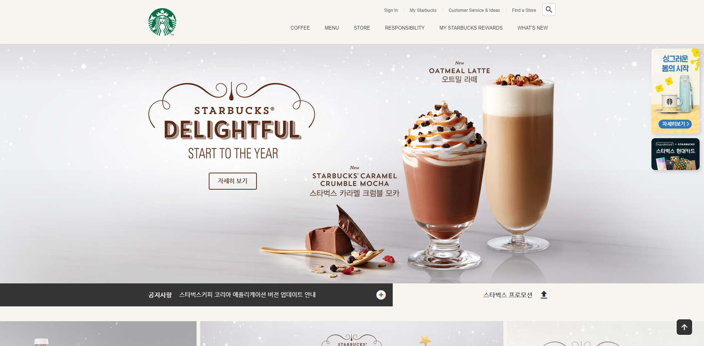
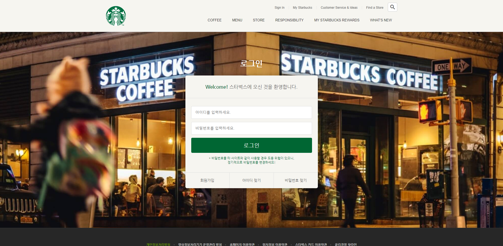

# ☕ Starbucks

> 스타벅스 페이지 클론코딩

[**사이트로 이동**](https://gallant-archimedes-4267b3.netlify.app/)

## 화면

|                             메인                             |                            로그인                            |
| :----------------------------------------------------------: | :----------------------------------------------------------: |
|  |  |

## 기술 스택

**Language** - , , 

**Deploy** - 

## 활용 API

- [**Google Fonts**](https://fonts.google.com/)

- [**Material.io**](https://material.io/resources/icons/?style=baseline)

- [**GSAP(The GreenSock Animation Platform)**](https://greensock.com/gsap/)
  - 자바스크립트로 제어하는 타임라인 기반의 애니메이션 라이브러리

- [**ScrollToPlugin**](https://greensock.com/scrolltoplugin/)
  - 스크롤 애니메이션을 지원하는 GSAP 플러그인
- [**Swiper**](https://swiperjs.com/)
  - 하드웨어 가속 전환과 여러 기본 동작을 갖춘 현대적인 슬라이드 라이브러리
- [**IFrame Player API**](https://developers.google.com/youtube/iframe_api_reference?hl=ko)
  - YouTube 동영상 제어
- [**ScrollMagic**](https://github.com/janpaepke/ScrollMagic)
  - 스크롤과 요소의 상호 작용을 위한 자바스크립트 라이브러리

- [**Lodash**](https://lodash.com/)
  - 다양한 유틸리티 기능을 제공하는 자바스크립트 라이브러리
